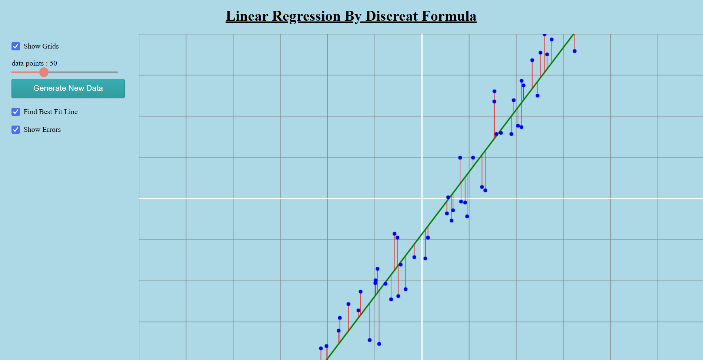

# ML Visualizer 🧠

An interactive, browser-based **machine learning playground** for exploring regression, classification, and dimensionality reduction algorithms — with live parameter tuning, real-time metrics, and beautiful dark/light UI.



---

## ✨ Features

| Feature | Details |
|---|---|
| 🗂 **Three ML categories** | Regression · Classification · Dimensionality Reduction |
| 🎨 **Dark / Light / System theme** | Toggle via the 🌙/☀️ button in the navbar |
| 🖊 **Draw your own data** | Click-and-drag brush to place points on the canvas |
| ⚙️ **Live hyperparameter tuning** | Sliders update results instantly |
| 📊 **Real-time metrics** | Right sidebar shows R², RMSE, confusion matrix, F1, etc. |
| 📉 **Loss curve** | Live training loss history for iterative algorithms |
| 🔵 **Smooth canvas** | Labeled axes, grid, origin marker, coordinate readout |
| 💬 **Tooltips everywhere** | Hover any control, metric, or data point for context |

---

## 🚀 Getting Started

This is a **pure static site** — no build step or server required.

### Option A — Open directly
```
double-click index.html
```
> ⚠️ Some browsers block ES Modules when opened via `file://`. Use Option B if you see a blank screen.

### Option B — Local HTTP server (recommended)
```bash
npx -y serve .
# Then open http://localhost:3000
```

---

## 🧮 Algorithms

### 📈 Regression
| Algorithm | Type | Key Parameters |
|---|---|---|
| **OLS Linear** | Closed-form | — |
| **BGD Linear** | Iterative | Learning Rate, Epochs |
| **SGD Linear** | Iterative | Learning Rate, Epochs |
| **Polynomial** | Iterative | Degree, Learning Rate, Epochs |
| **Ridge (L2)** | Closed-form | Lambda (λ) |

**Metrics:** R², Adjusted R², RMSE, MAE, slope, intercept

### 🔵 Classification
| Algorithm | Type | Key Parameters |
|---|---|---|
| **KNN** | Instance-based | k (neighbours) |
| **Logistic Regression** | Iterative (OvR) | Learning Rate, Epochs |
| **Decision Tree (CART)** | Recursive splits | Max Depth, Min Leaf Samples |
| **Gaussian Naive Bayes** | Closed-form | — |

**Metrics:** Accuracy, Precision, Recall, F1 Score, Confusion Matrix  
**Visuals:** Coloured decision regions; Decision Tree shows transparent split rectangles at each depth

### 🌐 Dimensionality Reduction
| Algorithm | Notes |
|---|---|
| **PCA** | Draws PC1 / PC2 axes, projected points, explained variance |

**Metrics:** PC1 / PC2 explained variance ratio, PC1 direction vector

---

## ⏭ Skipped Algorithms

The following are intentionally omitted — they require computation that is either too expensive for real-time browser animation or requires a significant external library:

| Algorithm | Reason skipped |
|---|---|
| **t-SNE** | Computationally expensive O(n²) iterative optimisation; produces visual artifacts in real-time |
| **SVM** | Requires quadratic programming solver (kernel methods non-trivial to implement without libraries) |
| **Random Forest** | Ensemble of trees; complex real-time boundary visualisation |
| **Neural Networks** | Requires full backprop framework; out of scope for static canvas visualisation |

---

## 🗂 Project Structure

```
Visualize-Linear-Regression/
├── index.html                  # App shell — layout, nav, sidebars
├── style.css                   # Dark/Light theme, CSS variables, UI
├── javascript/
│   ├── app.js                  # ★ Main controller (routing, animation, state)
│   ├── canvas_util.js          # Canvas wrapper (grid, axes, transforms)
│   ├── data_generator.js       # Synthetic data (linear, clusters, moons, etc.)
│   ├── metrics.js              # Shared statistics (R², RMSE, confusion matrix…)
│   ├── regression/
│   │   ├── ols.js
│   │   ├── bgd.js
│   │   ├── sgd.js
│   │   ├── polynomial.js
│   │   └── ridge.js
│   ├── classification/
│   │   ├── knn.js
│   │   ├── logistic.js
│   │   ├── decision_tree.js
│   │   └── naive_bayes.js
│   └── dimred/
│       └── pca.js
└── README.md
```

---

## 🎮 Usage Guide

### Data Source toggle (left sidebar)
- **Synthetic** — auto-generates random data using the sliders (N points, Noise, etc.)
- **Draw** — click/drag on the canvas with a configurable brush; for classification, pick the active class colour

### Running an algorithm
1. Select a category tab (Regression / Classification / Dim. Reduction)
2. Pick an algorithm from the left sidebar
3. Tune hyperparameters with the sliders
4. Click **Run Algorithm** (or it auto-runs for closed-form methods)
5. Watch the fit line / decision regions update live

### Controls
| Button | Action |
|---|---|
| **Pause / Resume** | Freeze or resume the animation loop |
| **Reset** | Clear canvas, data, and re-generate synthetic data |
| **Step Once** | Advance one training epoch (iterative algorithms only) |
| **Generate Data** | Create new random dataset with current settings |

---

## 🛠 Tech Stack

- **Vanilla HTML5 + CSS3 + JavaScript (ES Modules)** — no frameworks, no build step
- **Canvas 2D API** — all rendering
- **CSS Custom Properties** — design tokens for dark/light theme switching
- Google Fonts: **Inter** + **JetBrains Mono**

---

## 📄 License

MIT
