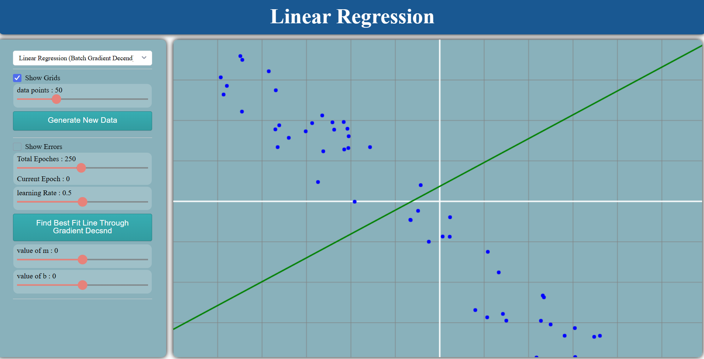

## Linear Regression Using Discret Formula

## Linear Regression

- linear regression is the most basic model in machine learning and is used to solve many problems.
- most of the more advanced algorithms uses linear regression as there backbone and are build on top of it.
- in this algorithm the data is used to create a best fit line which best approximates the data.

### Simple Linear Regression

- in simple linear regression we use only one column to fit the best fitting line. to minimize the error.
- it calculates two values for the equation of a line.

### How Linear Regression Works

- in higher dimensions you cant use discreet formula therefore you have to use gradient decent.
- discreet formula is called OLS regressor.

- to solve the LinearRegressor using OLS we find the values of **m** and **b** by these two formulas.

$$
B = \bar{y}-M\bar{x}
$$

$$
M = \frac{\displaystyle\sum_{i=1}^{n}(x_i-\bar{x})(y_i-\bar{y})}{\displaystyle\sum_{i=1}^{n}(x_i-\bar{x})^2}
$$

## The Final Solution Is Given By

$$
y=Mx+B
$$

